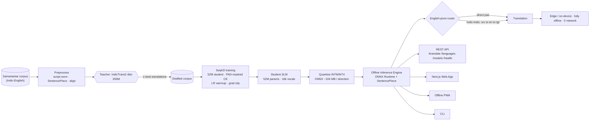
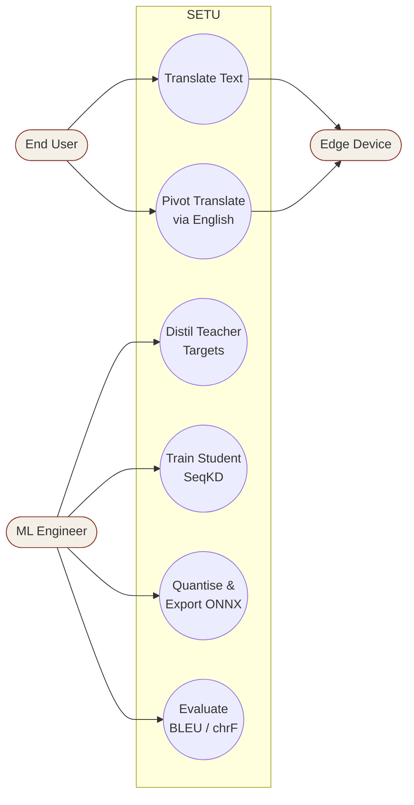
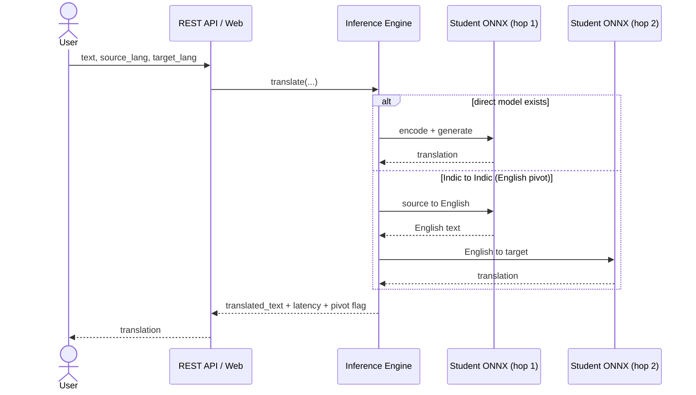
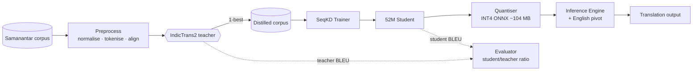
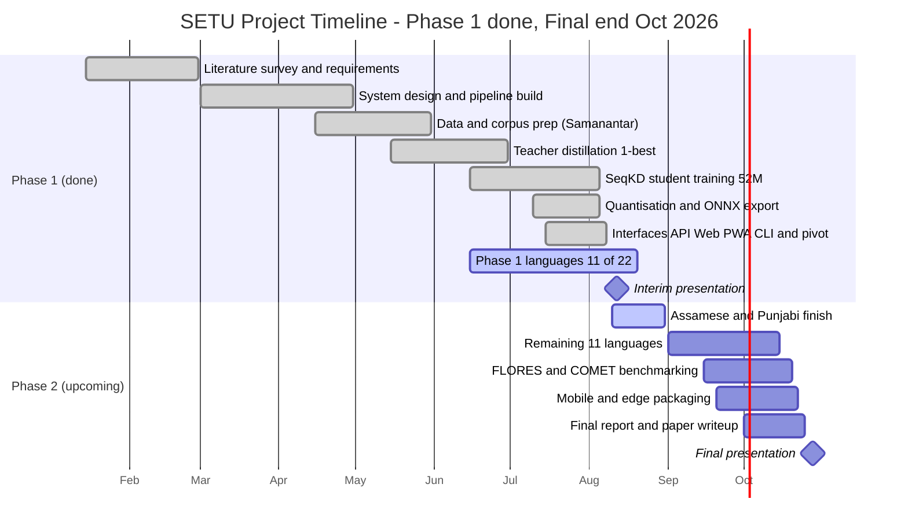

# SETU diagrams (Mermaid) — corrected to the real SeqKD + English-pivot system

Paste any block into <https://mermaid.live> to preview and **export SVG/PNG** for
the slides, or import into draw.io (Arrange → Insert → Advanced → Mermaid). These
replace the deck's old DPO / kNN-preference / AIO-KD diagrams.

---

## 1. System Design — SeqKD distillation & offline deployment pipeline (slide 18)

---

## 2. Use Case diagram (slide 15a)

---

## 3. Sequence diagram — translate request (slide 15b)

---

## 4. Data Flow Diagram (slide 15c)

---

## 5. Project timeline — Gantt (slide 17)

Phase 1 is complete (where we are today, mid-Aug 2026); Phase 2 runs to the
**final presentation at the end of October 2026**.

> Old deck's phases were Data Prep -> Teacher -> **Preference Gen (kNN)** -> **DPO**
> -> **AIO-KD** -> Quantise -> Deploy. Corrected here: the middle three collapse
> into a single **SeqKD training** stage (no preference/kNN/AIO-KD), and Phase 2
> is added through the October final.
